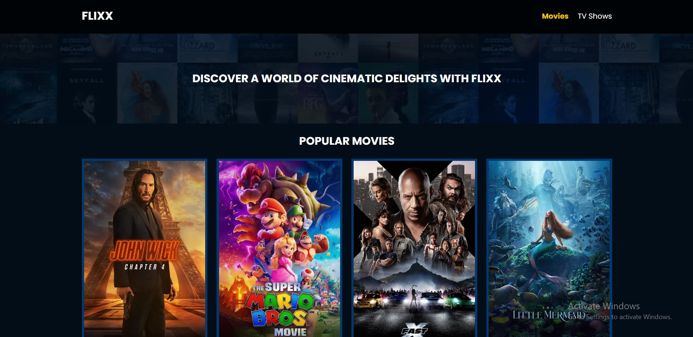
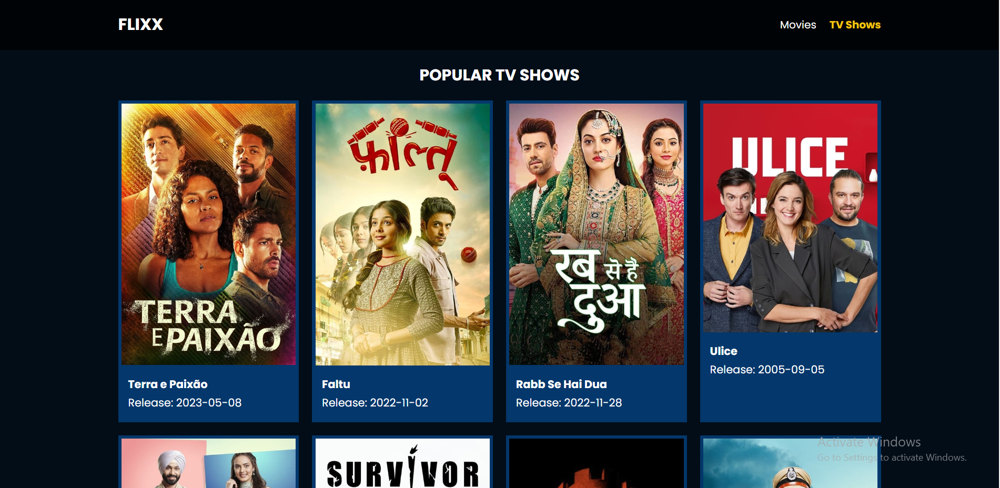
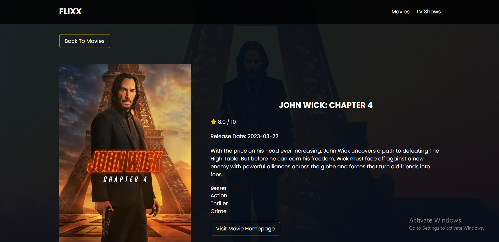

# Flixx - Find the most popular Movies and TV Shows
Welcome to Flixx! This is a JavaScript project that allows you to explore the most popular movies and TV shows using data fetched from TheMovieDatabase (TMDB). With Flixx, you can dive into the world of entertainment and discover the latest and greatest in the film and television industry.

## Functionality
1. **Fetching Data From The Movie Database (TMDB)**: We fetch the most popular Movies and TV Shows and display them on separate pages. Also fetch data for the individual movie or TV show, which shows more details.
2. **Custom Routes**: We are not using a third-party library or package for routing through different pages. All of the routing is custom with Vanilla JavaScript.
3. **Spinners**: We show spinners while loading the data from TMDB. 

## Technologies Used
This project uses the following technologies:
- HTML
- CSS
- JavaScript

## Project Screenshots

